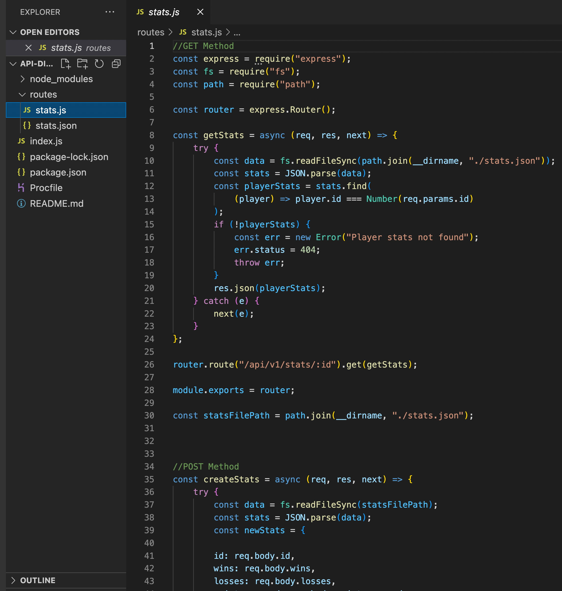
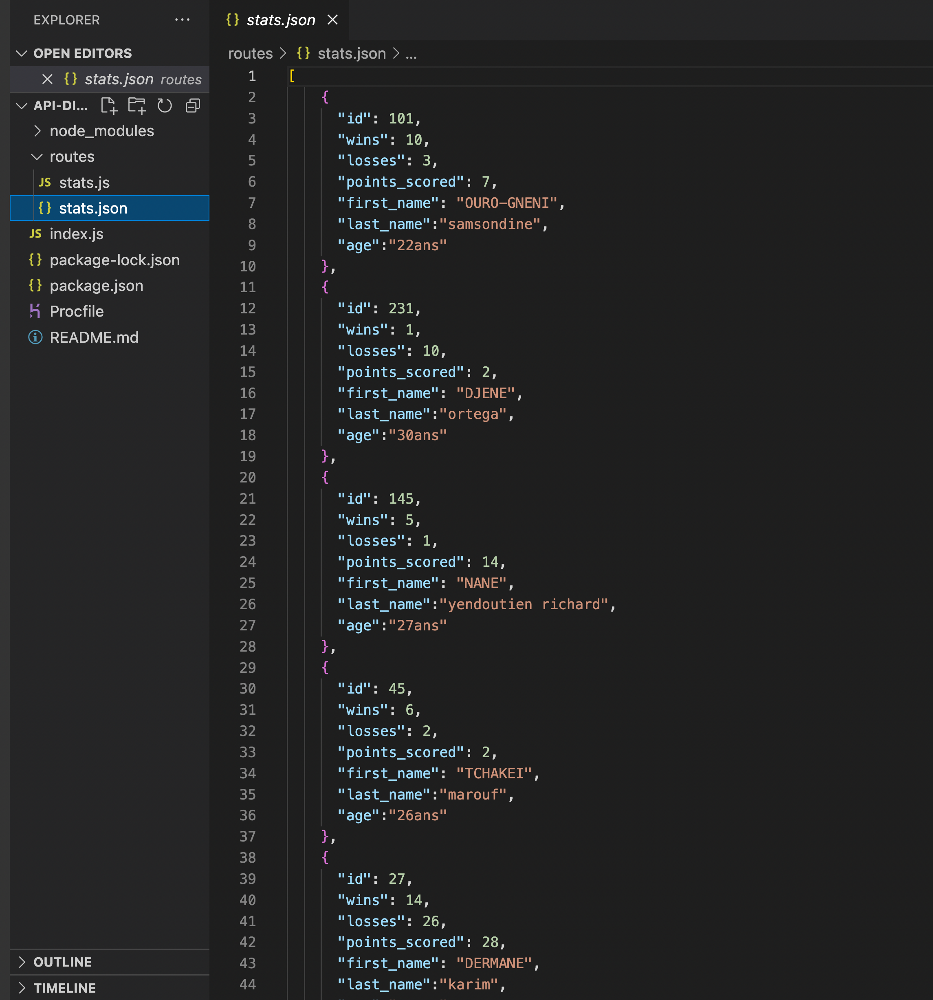
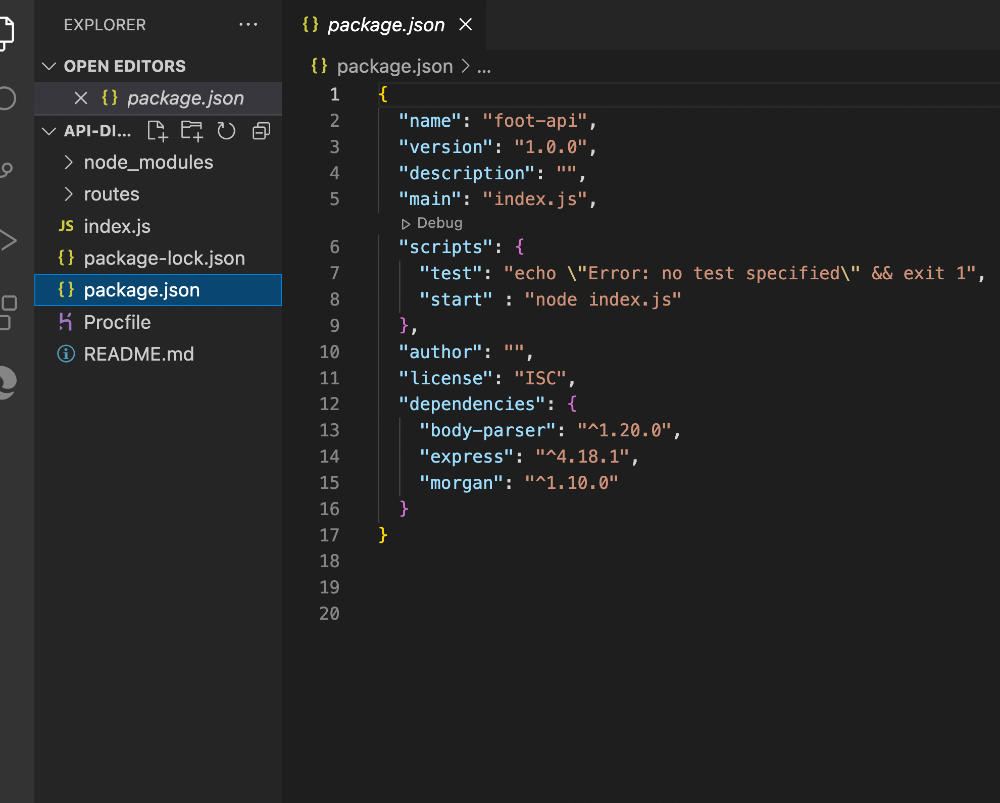

# API-digitalisation-des-donnees-de-la-FTF

notre projet consiste a cree un API REST pour la gestion des statistiques des joueurs de l equipe nationnale de football

## **`PRE-REQUIS`**

 -  savoir installer node js
 - savoir installer nvm Node Version Manager
 -savoir installer npm Node Package Manager 
 -savoir utiliser le framework Express

 ## **`INSTALLATION`**

 - cliquez sur le lien **[Node.JS](https://nodejs.org/en/)** choisir la bonne version node adapter a votre machine, telecharger et intaller
 
 aller dans terminal taper `node --version` pour etre sur de l avoir installer et connaitre la version

 - installer npm : taper la commande `npm install download` pour installer
 
 `npm --version`  pour connaitre la version


 ## **`DEMARAGE`**

 - creer votre dossier sur le bureau ,l'ouvrir dans le terminal,
 `npm init` pour demarer l installation du package ,suivre les etapes en appuiyant (ENTER) a chaque fois
 - Installation du framework EXPRESS(**_npm install express body-parser morgan_**)
- creer un fichier index.js dans lequel on copie

```js
const express = require('express');
const bodyParser = require('body-parser');
const logger = require('morgan');
const path = require('path');
const app = express();

const PORT = process.env.PORT || 3000;
const NODE_ENV = process.env.NODE_ENV || 'development';

app.set('port', PORT);
app.set('env', NODE_ENV);

app.use(logger('tiny'));
app.use(bodyParser.json());

app.use('/', require(path.join(__dirname, 'routes')));

app.use((req, res, next) => {
  const err = new Error(`${req.method} ${req.url} Not Found`);
  err.status = 404;
  next(err);
});

app.use((err, req, res, next) => {
  console.error(err);
  res.status(err.status || 500);
  res.json({
    error: {
      message: err.message,
    },
  });
});

app.listen(PORT, () => {
  console.log(
    `Express Server started on Port ${app.get(
      'port'
    )} | Environment : ${app.get('env')}`
  );
});
}
```
- crée un dossier appeler ROUTES

- crée dans le dossier un fichier STATS.JSON


- crée un autre appelle STATS.JS

-ajouter le script suivant au fichier packages.json
```
 ("scripts": {
  "start": "node index.js"
},)
```

- executer la commande `npm start` dans le dossier
- on nous envera un message
(**_Express Server started on Port 3000 | Environment : development_**)
- l API est pret a etre tester avec POSTMAN une fois heberger sur HEROKU ou tester en local avec localhost
## **`test avc postman avec lien heroku`** 


  - POST https://playerstats-api.herokuapp.com/api/v1/stats 
    -  Cela créera les statistiques d'un joueur

    ```json
    // ce sont les exemples d'entrée
      {
        "id": 23,
        "wins": 8,
        "losses": 2,
        "points_scored": 7
      }
    // il renverra un fichier json comme celui-ci
      {
        "id": 23,
        "wins": 8,
        "losses": 2,
        "points_scored": 7
      }
    ```


  - GET https://playerstats-api.herokuapp.com/api/v1/stats/23 
    - Cela obtiendra les statistiques du joueur 23

    ```json
    // il renverra un fichier json comme celui-ci
      {
        "id": 23,
        "wins": 8,
        "losses": 2,
        "points_scored": 7
      }
    ```
    
  - PUT https://playerstats-api.herokuapp.com/api/v1/stats/23 
    - Cela mettra à jour les statistiques du joueur 101

    ```json
    // c'est l'entrée
      {
        "id": 23,
        "wins": 10,
        "losses": 3,
        "points_scored": 7
      }
    // il renverra un fichier json comme celui-ci
    {
        "id": 23,
        "wins": 10,
        "losses": 3,
        "points_scored": 7
      }
    ```

  - DELETE https://playerstats-api.herokuapp.com/api/v1/stats/23
    -  Cela supprimera les statistiques du joueur 101

    ```json
    // c'est l'entrée 
      {
        "id": 101,
        "wins": 10,
        "losses": 3,
        "points_scored": 7
      }
    // et il renverra un fichier json vide
    ```


